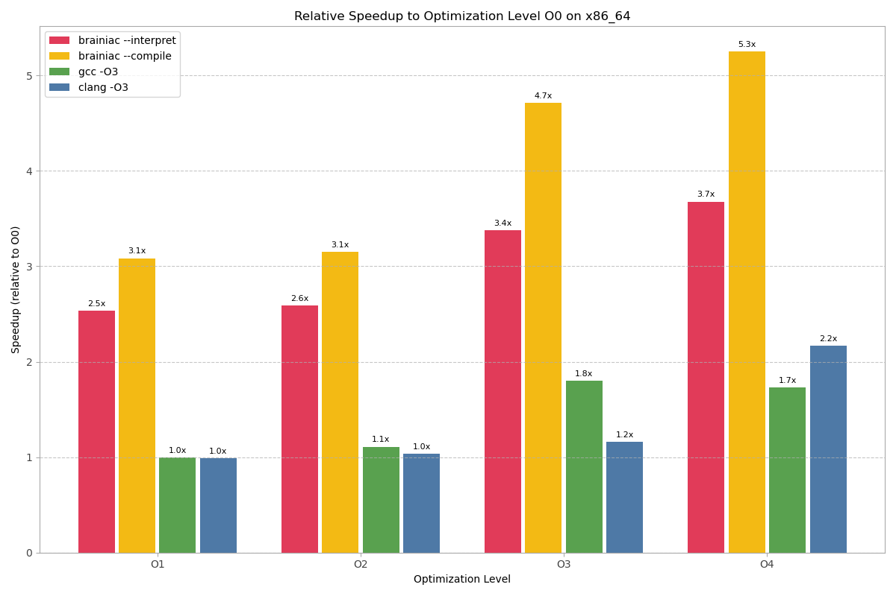

# Brainiac


Brainiac is a user-friendly and feature-rich [Brainfuck](https://en.wikipedia.org/wiki/Brainfuck) runtime. It runs interactively in the terminal and includes an optimizing interpreter and native code compiler for riscv64 and x86_64. For complete files a profiler and a transpiler for C and Zig are available. It's fast, memory safe, and colorful!

<!--
Generated by:
https://img.shields.io/badge/Brainiac-v0.9.2-blue.svg
https://img.shields.io/badge/license-AGPL-green.svg
-->


## Table of Contents

- [Status](#status)
- [What is Brainfuck?](#what-is-brainfuck)
- [Installation](#installation)
- [Optimizations](#optimizations)
- [Features and usage](#features-and-usage)
  - [Interactive Mode](#interactive-mode)
  - [Interpreter](#interpreter)
  - [Profiling](#profiling)
  - [Compilation](#compilation)
  - [Transpilation](#transpilation)
  - [Command Line Options](#command-line-options)
- [Memory Safety](#memory-safety)
- [Performance](#performance)
  - [x86_64](#x86_64)
  - [RISC-V](#risc-v)
  - [Relative Speedup](#relative-speedup)
- [License](#license)
- [Contributing](#contributing)
- [Acknowledgments](#acknowledgments)

## Status

Supported platforms:

| OS      | x86_64         | riscv64 |
|---------|----------------|---------|
| Linux   | `Yes`          | `Yes`   |
| Windows | `Yes`          | ?!      |

Builds tested for: Zig 0.13, Zig 0.15.

## What is Brainfuck?

Brainfuck is a minimalist esoteric programming language designed to challenge and amuse programmers with its extreme simplicity yet Turing-completeness. The language consists of eight commands and an infinite memory tape.

| Character | Description |
|-----------|-------------|
| `+` | Increment the value at the current cell |
| `-` | Decrement the value at the current cell |
| `>` | Move the pointer to the next cell |
| `<` | Move the pointer to the previous cell |
| `.` | Output the value at the current cell as an ASCII character |
| `,` | Read one character from input and store it in the current cell |
| `[` | Jump to the matching `]` if the current cell is zero |
| `]` | Jump back to the matching `[` if the current cell is not zero |

Other characters are ignored, allowing for creative code layouts and comment styling.

Despite its minimalism, Brainfuck is Turing-complete, allowing it to compute any computable function given enough time and memory.

## Installation

### Prebuilt binaries

Check out the [releases page](https://github.com/evelance/brainiac/releases) for prebuilt binaries for Linux and Windows.

### Building from source

You'll need [the Zig compiler](https://ziglang.org/download/) to build Brainiac.

If you have Zig installed, clone the repository and build it:
```bash
git clone https://github.com/evelance/brainiac.git
cd brainiac
zig build -Doptimize=ReleaseSafe
```

The final executable will be located in `zig-out/bin`. You can run it with:
```bash
./zig-out/bin/brainiac HelloWorld.b
```

Optionally, copy the executable to install it system-wide:
```bash
sudo cp ./zig-out/bin/brainiac /usr/local/bin/
```

## Optimizations

Brainiac supports multiple optimization levels that produce more powerful internal opcodes:
- -O1: **Constant folding**: Replace consecutive add/move operations with `add/move immediate` instructions
- -O2: **Set loop optimizations**: Replace patterns like `[-]+++` with `set immediate` instructions
- -O3: **Multiply-accumulate**: Replace loops like `[>+>++>---<<<-]` with `multiply-accumulate` instructions
- -O4: **Move elimination**: Fold moves into other operations in the form of a relative cell offset

The optimization level affects all runtime features: Both interpreted and compiled code runs significantly
faster, and the transpiler produces better code as well.

Performed optimizations can be seen in the profiler report, as in the following example of a modified "Hello World" program:

*Hello World program without any optimizations (-O0), 125 instructions:*


*After constant folding (-O1), 67 instructions:*


*After set loop optimizations (-O2), 64 instructions:*


*After multiply-accumulate (-O3), 57 instructions:*


*After move elimination (-O4), 46 instructions:*


## Features and usage

Brainiac can run Brainfuck programs interactively in the terminal, or from a file, or from stdin (pipe).
When a file is given as input, piped input will be treated as program inputs. Files can also be profiled and transpiled.

Supported cell sizes are 8, 16, 32, and 64 bit. Memory size and EOF character are configurable.

### Interactive Mode

Omit the input file to start the interactive mode or pass `--interactive` if you want to execute a given file first.
```bash
$ brainiac
Brainiac | Interpreter | -O4 | 1003520 8-bit cells
> ,
h
> .+.
hi
> -.+.[
| -]+++++++++++++++++++++++++++++++++.
hi!
```

### Interpreter

The interpreter is pretty slow but most versatile. It can stop programs after a fixed number of instructions or profile them while they are running. The HTML report generated by the profiler can be opened in a web browser to visualize the execution count of each instruction.

Interpret a file:
```bash
$ brainiac HelloWorld.b
Brainiac | Interpreter | -O4 | 1003520 8-bit cells
Hello World!
```

Interpret piped source code:
```bash
$ echo "++++[>+++++<-<->]>[>+++++<-<<++>>]>++++.+.<<<---." | brainiac --quiet
hi!
```

If you'd like to play the Brainfuck text adventure "Lost Kingdom"
by Jon Ripley but keep getting killed by evil magicians or rotten fish, pipe in the solution file instead:
```bash
$ brainiac --quiet LostKingdom.b < LostKingdomSolution.txt
Lost Kingdom
(C) Jon Ripley 2004, 2005
Brainfuck Edition v0.11

...

You have reclaimed your birthright and your crown.

*** You have won ***

You scored 99 points out of a possible 100.
You have earned the rank of Master, First Class.

Another game (Y/N) ? n

Thanks for playing.
```

### Profiling

Profile execution and memory use during interpretation of the program and generate an interactive HTML report afterward:

```bash
$ brainiac --verbose --profile Mandelbrot.b > mandelbrot-output.txt
Brainiac | Interpreter + profiler | -O4 | 1003520 8-bit cells
Parsing 11668 bytes
  11451 instructions parsed
   4115 after constant folding
   3839 after set loop optimization
   2887 after multiply-accumulate optimization
   1974 after offset optimization
Adjust danger zone: 87 cells
Execution time: 9370.039ms
Profiler results:
  Executed instructions: 2430007700
  Cell usage: 325 (-17..307)
  Value range: 0..255
Execution profile written to 'Mandelbrot.b.profile.htm'
```

Example reports can be seen in the [Optimizations section](#optimizations) and are useful to identify hotspots or dead code.

### Compilation

Compiles Brainfuck to native code and executes it immediately:

```bash
# Compile and run
brainiac --compile Mandelbrot.bf

# Print generated machine code, e.g. to disassemble it into instructions:
# https://defuse.ca/online-x86-assembler.htm
brainiac --compile --hexdump Mandelbrot.bf
```

The compiled native code runs ~10x faster than the interpreter.

The compiler works interactively, too, and supports all optimization levels, cell and memory sizes but neither profiling nor limiting the execution.

Compilation is only implemented for x86_64 and riscv64.

### Transpilation

Optimize Brainfuck program and generate C and Zig programs:

```bash
# Generate C and Zig code
brainiac --transpile=C Mandelbrot.b > Mandelbrot.c
brainiac --transpile=Zig Mandelbrot.b > Mandelbrot.zig

# Compile the generated C code
gcc -O3 Mandelbrot.c -o Mandelbrot
./Mandelbrot

# Compile and run the generated Zig code
zig run Mandelbrot.zig
```

### Command Line Options

```
  --interpret (default)
      Interpret source code.
  --compile[=outfile]
      Compile source code for the native architecture.
      If outfile is not given, run it directly (JIT mode).
      Supported architectures: riscv64, x86_64.
  --profile
      After interpreting the code, write HTML performance report of
      the source code into a file named <sourcefile>.profile.htm.
  --transpile=C|Zig
      Translate given optimized Brainfuck code into another language.
      The result is a standalone file that can be compiled directly.
  --hexdump
      Instead of running the compiled executable print generated
      machine code in hexadecimal form.
  --interactive
      After executing the sourcefile, switch to REPL (read-evaluate-
      print loop) mode.
  --limit=<n>
      Limit execution to n (optimized) instructions.
      Only available with --interpret and --profile.
  --cell=8|16|32|64 (default: 8)
      Memory cell size in bits.
  --memory=<n> (default: 1000000)
      Number of memory cells. Start cell is in the middle.
      As the operating system's paging mechanism is used to sandbox
      the Brainfuck application, the number of cells will be rounded
      up to match the minimum page size.
  -O0 Disable all optimizations.
  -O1 Allow simple optimizations:
       - Fold sequences of "+", "-", ">" and "<" into one opcode.
  -O2 Allow loop optimizations:
       - Convert "[-]" loops followed by one or more "+" or "-"
         into a single set value operation.
  -O3 Allow advanced optimizations:
       - Convert loops like "[<->>++>>+++<<<-]" into one or more
         multiply-accumulate (MAC) operations followed by set=0.
  -O4 (default)
       - Merge move operations into other operators as an offset.
  --io.binary
      Print cells directly as bytes.
  --io.prompt
      Print prompt symbol when the application does read operations.
  --io.eof=xx (default: 00)
      Hexadecimal value of byte returned on read operations on EOF.
      When not in interactive mode, reading again after receiving
      EOF will exit the program.
  --verbose
      Print additional information like number of parsed
      instructions, optimization results etc.
  --quiet
      Do not print first status line with execution information.
  -h, --help
      Show this help text.
  --version
      Show brainiac version.
```

## Memory Safety

Brainiac uses OS page protection to create danger zones on both sides of the "infinite" memory tape. If a program attempts to access cells beyond the allocated memory, it will trigger a segmentation violation, which Brainiac catches with a user-friendly error message instead of randomly crashing or corrupting process memory.

The size of these danger zones is adjusted based on static analysis of the maximum possible memory access offset.

## Performance

What would be the point of optimizations without benchmarks?
Let's see some numbers!

The following benchmarks were performed using Erik Bosman's Mandelbrot.b, which is both interesting and computationally intensive. Each measurement represents the fastest of three runs.

Transpiled C files were compiled with `gcc -O3` and `clang -O3`, Brainiac with `zig build -Doptimize=ReleaseFast`.

Some notes on the results:
- Native compilation provides approximately a 10x speedup over the interpreter on both architectures.
- Brainiac at higher optimization levels is competitive with GCC/Clang transpilation on x86_64, while on RISC-V, compiling transpiled C code with GCC or Clang yields better results.

### x86_64


Comparing compiled results only:


### RISC-V


Comparing compiled results only:


### Relative Speedup

The following charts show the speedup relative to the unoptimized (-O0) baseline:




## License

This project is licensed under the AGPL license - see the [LICENSE](LICENSE) text for details.

All files in the [bf/](./bf/) directory belong to their respective authors and may have varying licenses - see the [Acknowledgments](#acknowledgments) below.

## Contributing

All contributions are welcome, whether it's about typos, Zig code style, bugs, or ideas.

If you are somehow inclined to spend your valuable time on improving the execution of Brainfuck, feel free to create an issue or submit a pull request even 😉

The project is pretty modular, and new optimization passes or compiler backends should be easy to add without changing much unrelated code.

## Acknowledgments

- Urban Müller for creating the Brainfuck language
- The [Zig ⚡ programming language](https://ziglang.org/) and community
- All authors of the packaged Brainfuck programs:
  - [Daniel B. Cristofani](https://brainfuck.org/)
  - [Jon Ripley](https://jonripley.com/) et al.
  - [Linus Akesson](https://www.linusakesson.net/)
  - [Tim Alex Jacobs](https://mitxela.com/)
  - Erik Bosman
